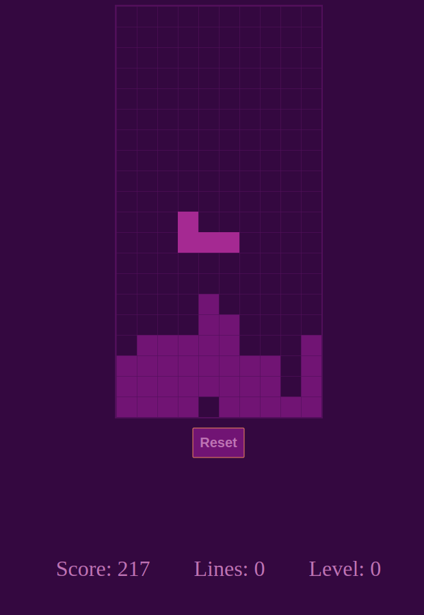

# Blocks
Kind of tetris game

  

# Getting started

## Development server

Run `npm start` for a dev server. Navigate to `http://localhost:4200/`. The app will automatically reload if you change any of the source files.

## Build

Run `npm run build` to build the project. The build artifacts will be stored in the `dist/` directory.

## Running unit tests

Run `npm t` to execute the unit tests via [Jest](https://jestjs.io/).

# How to play
Move the block around using the keyboard. .
* <kbd>a</kbd> - move left
* <kbd>d</kbd> - move right
* <kbd>s</kbd> - move down / soft drop 
* <kbd>w</kbd> - hard drop
* <kbd>l</kbd> - rotate
* <kbd>esc</kbd> - game over

# License
 [MIT](/LICENSE)

